# ¿Cómo funciona Git?

En esta lección, crearemos una imagen imaginaria de cómo funciona Git, el llamado modelo mental.

Tener el modelo mental correcto es crucial. Git es una herramienta compleja con muchas funciones, comandos y opciones, pero si logras crear el modelo mental adecuado, evitarás mucha confusión y frustración al trabajar con Git.

Esta imagen imaginaria de cómo funciona Git no tiene por qué ser 100% precisa ni cubrir todos los detalles. Simplemente tiene que ayudarte a comprender el estado en el que se encuentra tu proyecto y predecir qué sucederá cuando ejecutes un determinado comando.

Puedes utilizar varios modelos mentales para pensar en lo mismo. Cada modelo te ayudará a comprender un aspecto diferente del tema que intentas comprender. A lo largo de este curso, sugeriré algunas formas de imaginar cómo funciona Git en diferentes situaciones.

Así que aquí está el primer modelo mental: un juego de mesa de carreras. Algunos ejemplos de juegos de mesa de carreras son Snakes and Ladders, Game of the Goose y Monopoly. La cuestión es que tienes un tablero con casillas y una pieza que mueves por el tablero.

```mermaid
---
title: Ejemplo de juego de mesa
---
flowchart LR;
    S((Inicio))
    F((Final))
    A(&nbsp;&nbsp;&nbsp;&nbsp;&nbsp;&nbsp;&nbsp;&nbsp;&nbsp;)
    B(&nbsp;&nbsp;<span class="text-3xl">🥜</span>&nbsp;&nbsp;)
    C(&nbsp;&nbsp;&nbsp;&nbsp;&nbsp;&nbsp;&nbsp;&nbsp;&nbsp;)
    D(&nbsp;&nbsp;&nbsp;&nbsp;&nbsp;&nbsp;&nbsp;&nbsp;&nbsp;)
    E(&nbsp;&nbsp;&nbsp;&nbsp;&nbsp;&nbsp;&nbsp;&nbsp;&nbsp;)
    S---A
    A-->B
    B-->C
    C-->D
    D-->E
    E---F
```

        <br /><br />



        <br /><br />

Ahora relacionemos esta imagen con Git, el sistema de control de versiones distribuido.

## ¿Qué es Control de Versiones? [#que-es-control-de-versiones]

Los **Sistemas de Control de Versiones** (VCS) te permiten realizar un seguimiento de los cambios en tu código a lo largo del tiempo. Cada vez que realizas cambios, puedes crear una instantánea del nuevo estado de tu proyecto.

Esto también es similar a las ranuras para guardar en un videojuego. Puedes guardar el juego en cualquier momento y luego volver a ese punto más tarde.

Estas instantáneas serán nuestras casillas en el tablero. A diferencia del juego de mesa, donde todos los cuadrados se crean de antemano, en el control de versiones creamos los cuadrados sobre la marcha.

```mermaid
---
title: Modelo de Git como un juego de mesa
---
flowchart LR;
    A(&nbsp;<span class="text-xs">fj3s...</span>&nbsp;)
    B(&nbsp;<span class="text-xs">f4k3...</span>&nbsp;)
    C(&nbsp;<span class="text-xs">34b3...</span>&nbsp;)
    D(<span class="text-3xl">🥜</span><br/><span class="text-xs">d8ne...</span> <strong>HEAD</strong>)
    E(&nbsp;<span class="text-xs !text-gray-500">Nuevo commit</span>&nbsp;)
    A-->B
    B-->C
    C-->D
    D-->E
```

        <br /><br />



        <br /><br />

Cuando guardamos una instantánea de nuestro proyecto (creamos un **commit** en términos de Git), se crea un nuevo cuadrado y nuestra pieza se mueve allí automáticamente.

Ahora podemos volver a cualquiera de los cuadrados anteriores y ver cómo era el proyecto en ese momento.

También es similar a la función **deshacer/rehacer** de un editor de texto o de un programa de dibujo, pero es más potente. Con **deshacer/rehacer**, generalmente estás limitado a un cambio a la vez y si comienzas a realizar cambios después de deshacer algo, perderás los cambios que deshiciste.

Con el control de versiones, puedes saltar a cualquier punto de la línea de tiempo y si comienzas a hacer cambios después de eso, simplemente creas una nueva rama en la línea de tiempo, por lo que los cambios antiguos seguirán ahí.

Más adelante podrás optar por fusionar esta nueva versión con la línea de tiempo principal, descartarla o conservarla indefinidamente.

## ¿Qué es Control de Versiones Distribuido? [#que-es-control-de-versiones-distribuido]

Git es un Sistema de Control de Versiones Distribuido. Significa que todos los que trabajan en un proyecto tienen una copia del historial completo del proyecto en su computadora.

```mermaid
---
title: Sistema de Control de Versiones Distribuido
---
flowchart LR;
    A((<span class="text-6xl m-5">💻</span>))
    B((<span class="text-6xl m-5">💻</span>))
    C((<span class="text-6xl m-5">💻</span>))
    A<--->B
    B<--->C
    C<--->A
```

        <br /><br />



        <br /><br />

Con la analogía del tablero de juego, significa que todos tienen una copia del tablero y de la pieza. Cuando realizas un cambio en tu tablero, no afecta el tablero de nadie más. Para compartir tus cambios con otras personas, debes decirles explícitamente que se realizaron los cambios.

Lo contrario es un Sistema de Control de Versiones Centralizado. Significa que hay un servidor central que almacena todo el historial del proyecto. Cuando desees realizar un cambio, debes conectarte al servidor y enviarle los cambios. Si deseas volver a una versión anterior, debes conectarte al servidor y preguntarle cómo era esa versión en particular.

```mermaid
---
title: Sistema de Control de Versiones Centralizado
---
flowchart TD;
    A((<span class="text-6xl m-5">☁️</span>))
    B((<span class="text-6xl m-5">💻</span>))
    C((<span class="text-6xl m-5">💻</span>))
    D((<span class="text-6xl m-5">💻</span>))
    A<--->B
    A<--->C
    A<--->D
```



Para aplicar nuestra analogía con el juego de mesa, es como si hubiera un maestro del juego que se queda con el tablero y la pieza. Cuando quieras hacer un cambio, debes pedirle al maestro del juego que lo haga por ti. Si quieres volver a una versión anterior, le pides al director del juego que mueva la pieza y te envíe el tablero actualizado.

Para ser honesto, la mayoría de las veces Git se usa con un servidor central (como GitHub o GitLab), aunque puedes compartir los cambios directamente entre tus computadoras.

## ¿Cómo funciona Git? [#como-funciona-git]

Git almacena las instantáneas de tu trabajo como *commits*. Cada commit contiene una instantánea de todo el proyecto. Es similar a guardar una copia de todo el proyecto cada vez que realizas un cambio.

```mermaid
---
title: Instantáneas incrementales de Git
---
flowchart LR;
    A(<span class="text-3xl">⩊</span><br/><span class="text-xs">fj3s...</span>)
    B(<span class="text-3xl">•⩊•</span><br/><span class="text-xs">f4k3...</span>)
    C(<span class="text-3xl">^•⩊•^</span><br/><span class="text-xs">34b3...</span>)
    D(<span class="text-3xl">≽^•⩊•^≼</span><br/><span class="text-xs">d8ne...</span> <strong>HEAD</strong>)
    E(&nbsp;<span class="text-xs !text-gray-500">Nuevo commit</span>&nbsp;)
    A-->B
    B-->C
    C-->D
    D-->E
```



Cada vez que desees conservar el estado de tu proyecto, selecciona los cambios que deseas guardar y crea un commit.

Mira el gráfico de arriba. Cada vez que tenemos algunos cambios nuevos, creamos un nuevo commit. Cada commit tiene una identificación única. Más tarde podemos usar este ID para volver a el commit.

Además de almacenar el historial de cambios, Git también te permite conservar múltiples versiones del mismo proyecto. Para ello cuenta con una funcionalidad llamada *branches* o *ramas*.

        <br /><br />


        <br /><br />

Una rama es una secuencia de commits. Cuando creas una rama, creas una nueva secuencia de commits a partir de el commit actual.

Puedes crear varias ramas y trabajar en ellas en paralelo. Una vez que hayas terminado con la rama en particular, puedes volver a fusionarla.

## Git Workflow

Repasemos un flujo de trabajo típico, en el que creamos un nuevo proyecto, hacemos algunos cambios, los confirmamos y cambiamos entre commits.

Comenzamos con una carpeta vacía llamada `proyecto-ejemplo`. Primero, queremos convertir esta carpeta en un repositorio Git. Para ello ejecutamos el comando `git init` dentro de esta carpeta.

```bash filename="Terminal"
git init
```

```plaintext filename="Salida en la Terminal"
Initialized empty Git repository in /Users/esdocu/Proyectos/proyecto-ejemplo/.git/
```

Ahora tenemos un repositorio Git. Al principio, el repositorio está vacío, no contiene ningun commit, pero el `HEAD` ya existe y apunta a la rama `main`.

Puedes ver la rama actual ejecutando el comando `git status`.

```bash filename="Terminal"
git status
```

```plaintext filename="Salida en la Terminal"
On branch main
 
No commits yet
```

Estamos en una rama llamada `main` y aún no hay commits.

Imagínalo como una pieza de juego, por ahora sin casillas en el tablero.

Hagamos algunos cambios en nuestro proyecto para luego guardarlos como commits.

Comenzamos creando un archivo llamado `README.md`, que contendrá un texto corto.

```bash filename="Terminal"
echo "Solo un texto de ejemplo a escribir en este archivo" > README.md
```

Ahora tenemos un archivo llamado `README.md` en nuestro proyecto. Veamos si Git notó este cambio. Ejecuta el comando `git status`:

```bash filename="Terminal"
git status
```

```plaintext filename="Salida en la Terminal"
On branch main
 
No commits yet
 
Untracked files:
  (use "git add <file>..." to include in what will be committed)
	README.md
 
nothing added to commit but untracked files present (use "git add" to track)
```

El mensaje cambió, ahora dice que tenemos un archivo sin seguimiento. Significa que Git notó que creamos un nuevo archivo, pero aún no está incluido en ningun commit.

Para guardar el estado actual del proyecto como un commit, primero debemos seleccionar los cambios que deseamos incluir allí. Hacemos esto con el comando `git add`.

Puedes imaginar que el comando `git add` funciona de manera similar a cómo funciona la selección de archivos en un administrador de archivos. Selecciona los archivos que deseas incluir en el commit.

En nuestro caso, `README.md` es un archivo nuevo que queremos incluir en nuestra primer commit, por lo que ejecutamos `git add README.md`.

```bash filename="Terminal"
git add README.md
```

Ahora hemos seleccionado los cambios en el archivo, en términos de Git, hemos preparado los cambios. Consultemos el estado del proyecto:

```bash filename="Terminal"
git status
```

```plaintext filename="Salida en la Terminal"
On branch main
 
No commits yet
 
Changes to be committed:
  (use "git rm --cached <file>..." to unstage)
	new file:   README.md
```

Ahora `README.md` aparece en la sección *Changes to be committed* (Cambios a confirmar). Significa que los cambios en este archivo se seleccionan para incluirse en el próximo commit.

Podemos guardar los cambios con el comando `git commit`. También debemos proporcionar un mensaje para el commit. El mensaje debe describir los cambios que hicimos allí.

Si ejecutamos `git commit` sin ningún argumento, Git abrirá un editor de texto y nos pedirá que ingresemos el mensaje allí. Pero también podemos proporcionar el mensaje directamente en la terminal con la opción `-m`.

```bash filename="Terminal"
git commit -m "Añade un archivo README.md"
```

```plaintext filename="Salida en la Terminal"
[main (root-commit) 7c63aa7] Añade un archivo README.md
 1 file changed, 1 insertion(+)
 create mode 100644 README.md
```

¡Voilá! Hemos creado nuestro primer commit. Podemos ver que este commit tiene un identificador único `7c63aa7` y tiene un mensaje `Añade un archivo README.md`. Git crea automáticamente identificadores únicos para cada commit, de modo que podamos consultarlos más adelante.

        <br /><br />


        <br /><br />

Ahora nuestro repositorio tiene un commit y HEAD apunta a el. Consultemos el estado del proyecto:

```bash filename="Terminal"
git status
```

```plaintext filename="Salida en la Terminal"
On branch main
nothing to commit, working tree clean
```

Git dice que no hay cambios que realizar. Significa que nada ha cambiado desde la última vez que creamos un commit.

Digamos que agregamos otra línea de texto al archivo.

```bash filename="Terminal"
echo "Una segunda línea de ejemplo en este archivo" >> README.md
```

Si comprobamos el estado del proyecto veremos que tenemos un archivo modificado.

```bash filename="Terminal"
git status
```

```plaintext filename="Salida en la Terminal"
On branch main
Changes not staged for commit:
  (use "git add <file>..." to update what will be committed)
  (use "git restore <file>..." to discard changes in working directory)
	modified:   README.md
 
no changes added to commit (use "git add" and/or "git commit -a")
```

Preparar y confirmar los cambios:

```bash filename="Terminal"
git add README.md
git commit -m "Añade otra línea de texto al archivo README.md"
```

```plaintext filename="Salida en la Terminal"
[main a16cd19] Añade otra línea de texto al archivo README.md
 1 file changed, 1 insertion(+)
```

Ahora tenemos dos commits en nuestro proyecto. Podemos ver el historial de commits con el comando git log.

```bash filename="Terminal"
git log --oneline
```

```plaintext filename="Salida en la Terminal"
a16cd19 (HEAD -> main) Añade otra línea de texto al archivo README.md
7c63aa7 Añade un archivo README.md
```

Los commits se ordenan del más nuevo al más antiguo. Con los commits más recientes en la parte superior.

Utiliza un indicador `--oneline` para acortar la salida. Muestra solo la primera línea del mensaje del commit y el hash del commit.

También puedes ver hacia dónde apunta el HEAD.

        <br /><br />


        <br /><br />

Volviendo a la analogía del tablero de juego, tenemos un tablero con dos casillas y la pieza está en la segunda casilla.

Podemos mover la pieza nuevamente al primer cuadrado con el comando `git checkout`.

```bash filename="Terminal"
git checkout 7c63aa7
```

```plaintext filename="Salida en la Terminal"
Note: switching to '7c63aa7'.
```

Esto restablecerá el contenido de la carpeta de tu proyecto al estado del primer commit.

        <br /><br />


        <br /><br />

Si comprobamos el contenido del archivo `README.md` veremos que sólo contiene la primera línea de texto.

```bash filename="Terminal"
cat README.md
```

```plaintext filename="Salida en la Terminal"
Solo un texto de ejemplo a escribir en este archivo
```

También podemos ver que `HEAD` apunta al primer commit.

```bash filename="Terminal"
git log main --oneline
```

```plaintext filename="Salida en la Terminal"
a16cd19 (main) Añade otra línea de texto al archivo README.md
7c63aa7 (HEAD) Añade un archivo README.md
```

Ahora podemos volver a los últimos cambios usando el comando `git checkout`:

```bash filename="Terminal"
git checkout a16cd19
```

```plaintext filename="Salida en la Terminal"
Previous HEAD position was 7c63aa7 Añade un archivo README.md
HEAD is now at a16cd19 Añade otra línea de texto al archivo README.md
```

Y el texto vuelve a estar completo:

```bash filename="Terminal"
cat README.md
```

```plaintext filename="Salida en la Terminal"
Solo un texto de ejemplo a escribir en este archivo
Una segunda línea de ejemplo en este archivo
```

Aquí tienes, esta es la esencia de Git. Puedes crear instantáneas (commits) de tu proyecto y moverte entre ellas.
