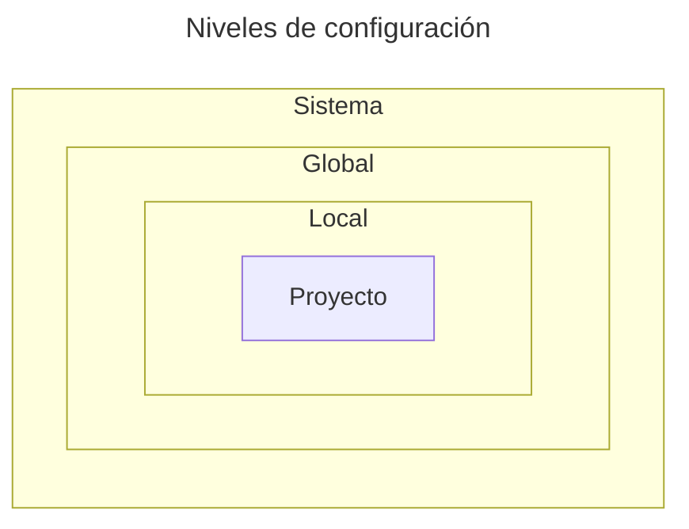

# Configuración de Git

Lo primero que debes hacer después de haber instalado Git es configurarlo. Como mínimo, debes configurar tu nombre y dirección de correo electrónico. Esta información se utilizará para identificarte como el autor de los commits que realices.

Git se puede configurar editando los archivos de configuración o usando el comando `git config`. En esta lección, aprenderemos cómo configurar Git usando ambos métodos.

**Cubriremos:**

* Diferentes niveles en los que se puede configurar Git.
* Cómo configurar Git usando archivos de configuración.
* Cómo establecer, eliminar y ver los ajustes de configuración mediante el comando `git config`.

Terminaremos la lección con ejercicios que te ayudarán a solidificar tus conocimientos. Estos ejercicios no sólo te ayudarán a practicar, sino que también te presentarán algunas configuraciones útiles que puedes utilizar en tus proyectos.

Configuraremos tu editor predeterminado, configuraremos comandos `diff` personalizados y crearemos alias de comandos para comandos comunes.

## Niveles de configuración [#niveles-de-configuracion]

Git se puede configurar en tres niveles distintos:

* **Sistema**: Estas configuraciones se aplican a todos los usuarios del sistema y a todos los repositorios. Se almacenan en el archivo `/etc/gitconfig` en sistemas Linux y macOS. En los sistemas Windows, se almacenan en el archivo `C:\ProgramData\Git\config`.
* **Global**: Esta configuración se aplica a todos los repositorios del usuario actual. Se almacenan en el archivo `~/.gitconfig` (`C:\Users\<user>\.gitconfig` en Windows).
* **Local**: El nivel predeterminado. La configuración de este nivel se aplica sólo al repositorio actual. Se almacenan en el archivo `.git/config` dentro del directorio del repositorio.

La prioridad de los niveles de configuración es la siguiente:

* Local
* Global
* Sistema

Significa que si tienes una configuración definida a nivel local, anulará la misma configuración definida a nivel global o de sistema.



En otras palabras, Git siempre toma la configuración más cercana al repositorio en el que estás trabajando. Si no encuentra la configuración allí, la buscará en la configuración global. Si no lo encuentra allí lo buscará en la configuración del sistema.

Por lo general, querrás configurar tu usuario a nivel global, dejar la configuración a nivel del sistema como está y, a veces, realizar ajustes para un repositorio específico a nivel local.

## Configurar Git usando archivos de texto

Puedes editar manualmente los ajustes de configuración abriendo el archivo de configuración respectivo en un editor de texto. Por ejemplo, para editar la configuración global, puedes abrir `~/.gitconfig` y realizar los cambios.

Aquí está el contenido del archivo `~/.gitconfig` en mi sistema:

```plaintext filename="~/.gitconfig"
[user]
	name = Esdocu Cursos
	email = hola.esdocu@gmail.com
[init]
	defaultBranch = main
```

Este archivo contiene el nombre de usuario y el correo electrónico que uso para mis commits. También contiene el nombre de rama predeterminado que uso cuando inicializo un nuevo repositorio.

Los archivos de configuración constan de propiedades agrupadas en secciones. Una propiedad es una clave y un valor delimitados por un signo igual:

```plaintext
key = value
```

Una sección es un grupo de propiedades que están entre corchetes:

```plaintext
[section]
	key = value
```

## Lista completa de configuraciones disponibles

Puede encontrar la lista completa de ajustes de configuración en la documentación de Git (https://git-scm.com/docs/git-config#_variables).

Las variables allí están escritas en el siguiente formato:

```plaintext
section.key
```

Entonces, por ejemplo, si la configuración aparece como `user.name`, significa que está ubicada en la sección de `user` y la clave es `name`:

```plaintext filename="Configuración de Git"
[user]
	name = Esdocu Cursos
```

## Usando el comando de configuración

Git proporciona una interfaz de línea de comandos para administrar los ajustes de configuración. El comando se llama `git config`. Se puede utilizar para establecer, eliminar y ver ajustes de configuración.

Si ejecutas este comando sin ningún argumento, te mostrará la lista de opciones disponibles. Por ahora, usaremos sólo algunas de ellas, pero es bueno saber que hay más opciones disponibles.

Puedes especificar el nivel en el que deseas editar la configuración proporcionando las opciones `--global`, `--local` o `--system`. Si no especificas el nivel, se utilizará el nivel local de forma predeterminada.

## Configuración de opciones de configuración

Para establecer un valor de configuración, ejecuta `git config` con los argumentos `<option>` y `<value>`:

```bash filename="Terminal"
git config <option> <value>
```

Por ejemplo, para configurar el nombre de usuario, puedes ejecutar el siguiente comando:

```bash filename="Terminal"
git config user.name "Esdocu Cursos"
```

Aquí tenemos que usar comillas porque el nombre de usuario contiene un espacio. Si no utilizas las comillas, Git tratará a `Esdocu` y `Cursos` como dos argumentos separados.

De forma predeterminada, establecerá la configuración a nivel local. Para configurarlo a nivel global tienes que usar la opción `--global`:

```bash filename="Terminal"
git config --global user.name "Esdocu Cursos"
```

Esto establecerá el nombre de usuario en el archivo `~/.gitconfig`.

Para especificar el nombre de la rama predeterminada, puedes ejecutar el siguiente comando:

```bash filename="Terminal"
git config --global init.defaultBranch main
```

Ahora, cuando ejecutes `git init`, creará un nuevo repositorio con la rama `main`.

## Eliminación de ajustes de configuración

Para eliminar una configuración, debe usar la opción `--unset`:

```bash filename="Terminal"
git config --unset <option>
```

Por ejemplo, para eliminar el nombre de usuario, puedes ejecutar el siguiente comando:

```bash filename="Terminal"
git config --unset user.name
```

Esto eliminará la configuración de nombre de usuario del archivo de configuración del repositorio actual.

Para eliminar la configuración del archivo de configuración global, debes usar la opción `--global`:

```bash filename="Terminal"
git config --global --unset user.name
```

## Visualización de los ajustes de configuración

Para ver la configuración, puedes ejecutar el siguiente comando en la línea de comando:

```bash filename="Terminal"
git config --list
```

Este comando te mostrará configuraciones combinadas de los tres niveles.

Para mí, genera lo siguiente:

```bash filename="Terminal"
git config --list
```

```plaintext filename="Salida en la Terminal"
user.name=Esdocu Cursos
user.email=hola.esdocu@gmail.com
init.defaultbranch=main
```

Para limitar la salida a la configuración del archivo de configuración específico, puedes usar las opciones `--local`, `--global` o `--system`:

```bash filename="Terminal"
git config --local --list
git config --global --list
git config --system --list
```

También puedes verificar la configuración abriendo el archivo de configuración en un editor de texto.

## Ejercicios

### Establecer nombre y correo electrónico

Establece el nombre de usuario y el correo electrónico en la configuración global. Abre la terminal y ejecute los siguientes comandos:

```bash filename="Terminal"
git config --global user.name <tu nombre>
git config --global user.email <tu email>
```

Cambia `<tu nombre>` y `<tu email>` por el nombre y el correo electrónico que desees utilizar.

En la terminal, tendrás que escribir el nombre y el correo electrónico entre comillas si contienen espacios. De lo contrario, el terminal los tratará como argumentos separados.

### Ver configuraciones

Verifica la configuración.

Abre la terminal y ejecuta el siguiente comando desde el directorio de home:

```bash filename="Terminal"
git config --list
```

Deberías ver el nombre de usuario y el correo electrónico que configuraste en el ejercicio anterior.

### Establecer nombre de sucursal predeterminado

Establece el nombre de rama predeterminado en `main`.

Abre la terminal y ejecuta el siguiente comando:

```bash filename="Terminal"
git config --global init.defaultBranch main
```

### Establecer el editor predeterminado

Establece el editor predeterminado. Puedes usar cualquier editor que quieras. Aquí hay unos ejemplos:

* nano
* Vim
* code (Visual Studio Code)
* subl (Sublime Text)
* Notepad (Bloc de notas en Windows)

Este editor se utilizará para ingresar mensajes del commit.

Asegúrate de que el editor esté instalado en tu sistema.

Abre la terminal y ejecuta el siguiente comando:

```bash filename="Terminal"
git config --global core.editor <editor>
```

Verifica que funcionó intentando realizar cambios. Crea un nuevo repositorio con un archivo y agrega algo de contenido. Ábrelo en la consola y ejecuta los siguientes comandos:

```bash filename="Terminal"
git add .
git commit
```

Se debería abrir el editor que configuraste en el paso anterior. Por defecto, será Vim. Si no sabes cómo usarlo, puedes presionar `i` para ingresar al modo de inserción, escribir el mensaje del commit y luego presionar `Esc` y escribir la secuencia especial de teclas `:wq` para guardar y salir.

### Configurar alias de comando personalizados

Establece el alias `st` para el comando 'status'.

Abre la terminal y ejecuta el siguiente comando:

```bash filename="Terminal"
git config --global alias.st status
```

Verifica que funcionó abriendo un repositorio (por ejemplo, uno de los ejercicios) y ejecutando el siguiente comando:

```bash filename="Terminal"
git st
```

Deberías ver el mismo resultado que si ejecutaras `git status`.