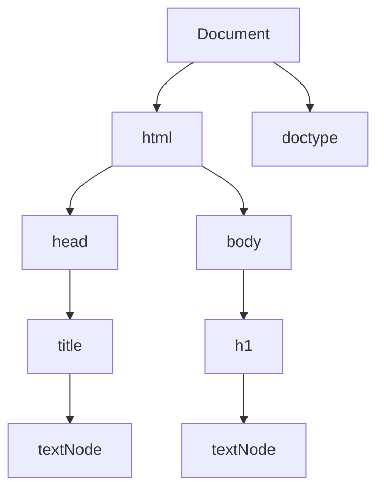

# El Modelo de Objetos de Documento (DOM) en JavaScript

El **Modelo de Objetos de Documento (DOM)** es una representación orientada a objetos de una página web, donde cada elemento de la página, como un botón, una imagen o un texto, se representa como un objeto con su propio conjunto de propiedades y métodos. El **DOM** es una interfaz de programación para documentos **HTML** y **XML**, que nos permite utilizar JavaScript para acceder y actualizar el contenido, estructura y estilo de una página web. Con el DOM, podemos escuchar eventos, como el clic en un botón, y responder a ellos. También podemos crear nuevos elementos y atributos, cambiar el contenido de elementos existentes o eliminar elementos de la página.

El DOM representa un documento como un árbol de nodos. La palabra **nodo** se refiere a un único punto en una estructura de datos y, en el caso del DOM, representa un elemento o un fragmento de texto en la página web.
Cada nodo es un objeto que representa una parte del documento. La estructura en forma de árbol del DOM está formada por relaciones padre-hijo entre los nodos, y cada elemento contiene otros elementos, que pueden considerarse como nodos secundarios.

Por ejemplo, en un documento HTML, un nodo representaría un elemento como un párrafo `<p>Hola mundo</p>` y el texto `'Hola mundo'` sería un nodo secundario del nodo de párrafo `p`. Los nodos proporcionan una forma de representar la página web de forma lógica y jerárquica (desde la parte superior de la página hasta la parte inferior), lo que facilita la navegación y la comprensión de la estructura del documento.

Echemos un vistazo a un documento HTML simple:

```html filename="HTML"
<!DOCTYPE html>
<html>
    <head>
        <title>Mi página web</title>
    </head>
    <body>
        <h1>¡Esto es increíble!</h1>
    </body>
</html>
```

El árbol DOM para este documento se vería así:



En esta representación de árbol, el `Document` es el nodo raíz y tiene dos hijos: el nodo `html` y el nodo `doctype`. El nodo `html` es el contenedor de todos los demás elementos de la página web y tiene dos hijos: `head` y `body`. El nodo `head` contiene el elemento de título `title`, que a su vez tiene un nodo de texto secundario con el texto `'Mi página web'`. El nodo `body` tiene un hijo: el elemento `h1`. El elemento `h1` contiene un nodo secundario de texto con el texto `'¡Esto es increíble!'`.

