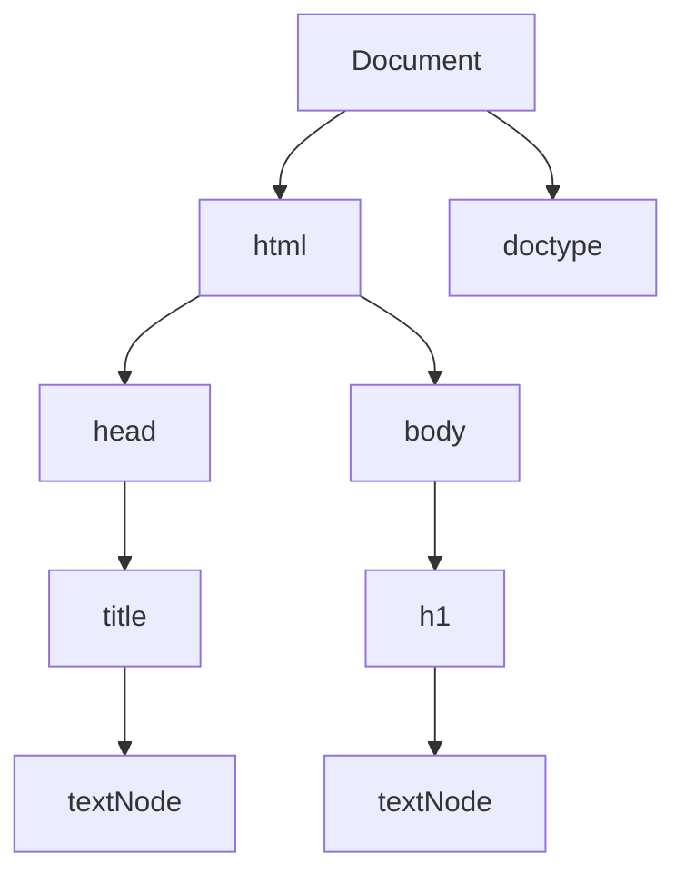

# El Modelo de Objetos de Documento (DOM) en JavaScript

El **Modelo de Objetos de Documento (DOM)** es una representación orientada a objetos de una página web, donde cada elemento de la página, como un botón, una imagen o un texto, se representa como un objeto con su propio conjunto de propiedades y métodos. El **DOM** es una interfaz de programación para documentos **HTML** y **XML**, que nos permite utilizar JavaScript para acceder y actualizar el contenido, estructura y estilo de una página web. Con el DOM, podemos escuchar eventos, como el clic en un botón, y responder a ellos. También podemos crear nuevos elementos y atributos, cambiar el contenido de elementos existentes o eliminar elementos de la página.

El DOM representa un documento como un árbol de nodos. La palabra **nodo** se refiere a un único punto en una estructura de datos y, en el caso del DOM, representa un elemento o un fragmento de texto en la página web.
Cada nodo es un objeto que representa una parte del documento. La estructura en forma de árbol del DOM está formada por relaciones padre-hijo entre los nodos, y cada elemento contiene otros elementos, que pueden considerarse como nodos secundarios.

Por ejemplo, en un documento HTML, un nodo representaría un elemento como un párrafo `<p>Hola mundo</p>` y el texto `'Hola mundo'` sería un nodo secundario del nodo de párrafo `p`. Los nodos proporcionan una forma de representar la página web de forma lógica y jerárquica (desde la parte superior de la página hasta la parte inferior), lo que facilita la navegación y la comprensión de la estructura del documento.

Echemos un vistazo a un documento HTML simple:

```html filename="HTML"
<!DOCTYPE html>
<html>
    <head>
        <title>Mi página web</title>
    </head>
    <body>
        <h1>¡Esto es increíble!</h1>
    </body>
</html>
```

El árbol DOM para este documento se vería así:



En esta representación de árbol, el `Document` es el nodo raíz y tiene dos hijos: el nodo `html` y el nodo `doctype`. El nodo `html` es el contenedor de todos los demás elementos de la página web y tiene dos hijos: `head` y `body`. El nodo `head` contiene el elemento de título `title`, que a su vez tiene un nodo de texto secundario con el texto `'Mi página web'`. El nodo `body` tiene un hijo: el elemento `h1`. El elemento `h1` contiene un nodo secundario de texto con el texto `'¡Esto es increíble!'`.

## Accediendo al DOM

Usar JavaScript para acceder al DOM es sencillo. Primero, creemos un documento HTML. Pega el siguiente código en un archivo llamado `index.html` y luego ábrelo en tu navegador:

```html filename="HTML"
<!DOCTYPE html>
<html>
    <head>
        <title>Conociendo el DOM</title>
    </head>
    <body>
        <h1>Usando JavaScript para acceder al DOM</h1>
        <p>DOM significa Modelo de Objetos de Documento</p>
    </body>
</html>
```

Ahora, abre las herramientas de desarrollo del navegador y navega hasta la consola. Aquí es donde escribiremos nuestro código JavaScript.

A través del DOM podemos acceder a los elementos de nuestra página web, incluidos los elementos `title`, `h1` y `p`. 

Primero, necesitamos obtener una referencia al elemento al que queremos acceder. El navegador proporciona un objeto global llamado `document` que representa el DOM, que podemos utilizar para acceder a todos los elementos de nuestra página web. Por ejemplo, para acceder al elemento de `title`, podemos usar la propiedad `title` del objeto de `document`. En la consola del navegador de tu página web, escribe el siguiente código y presione *Enter*:

```javascript filename="JavaScript"
document.title
```

Esto devolverá el texto `'Conociendo el DOM'`. La propiedad `title` del objeto `document` es una referencia al elemento `title` de la página web. También podemos acceder a los elementos `head` y `body` usando las propiedades `head` y `body` del objeto `document`:

```javascript filename="JavaScript"
document.head
// Salida: <head>...</head>

document.body
// Salida: <body>...</body>
```

### El método `getElementsByTagName`

El objeto `document` tiene un método `getElementsByTagName` que se puede utilizar para acceder a elementos por su nombre de etiqueta. Este método toma un argumento de cadena, que es el nombre de la etiqueta. Para acceder al elemento `h1`, escribe el siguiente código en la consola:

```javascript filename="JavaScript"
document.getElementsByTagName('h1')
```

Esto devolverá un `HTMLCollection` que contiene una referencia al elemento `h1`. Un `HTMLCollection` es un objeto similar a un array que contiene referencias a los elementos de una página web. Cuando usamos el método `getElementsByTagName`, devuelve un `HTMLCollection` que contiene referencias a todos los elementos con el nombre de etiqueta especificado en un orden jerárquico. Como solo tenemos un elemento `h1` en nuestro `document`, `HTMLCollection` contiene solo un elemento. Así es como se ve la salida de la consola:

```javascript filename="JavaScript"
HTMLCollection[h1]
```

Si tuviéramos dos elementos `h1`, `HTMLCollection` contendría dos elementos:

```javascript filename="JavaScript"
HTMLCollection[(h1, h1)]
```

Para acceder al elemento `h1` en `HTMLCollection`, podemos usar la notación entre corchetes, tal como lo haríamos con un array:

```javascript filename="JavaScript"
document.getElementsByTagName('h1')[0]
```

Esto devolverá el elemento `h1`:

```javascript filename="JavaScript"
<h1>Usando JavaScript para acceder al DOM</h1>
```

También podemos acceder al elemento `h1` utilizando el método `item` de `HTMLCollection`, que toma un índice como argumento:

```javascript filename="JavaScript"
document.getElementsByTagName('h1').item(0)

// Salida: <h1>Usando JavaScript para acceder al DOM</h1>
```

Ahora que tenemos acceso al elemento `h1`, podemos obtener el contenido de texto del elemento `h1` usando la propiedad `textContent` o `innerText`:

```javascript filename="JavaScript"
document.getElementsByTagName('h1')[0].textContent
// Salida: "Usando JavaScript para acceder al DOM"

document.getElementsByTagName('h1')[0].innerText
// Salida: "Usando JavaScript para acceder al DOM"
```

Las propiedades `textContent` e `innerText` se utilizan para obtener o establecer el contenido de texto de un elemento HTML. La propiedad `innerText` tiene en cuenta los estilos aplicados al texto, como la visibilidad, y no devolverá el texto si está oculto por CSS, mientras que la propiedad textContent devolverá el texto independientemente de los estilos que se le apliquen. 

Dado que las propiedades DOM dependen del navegador, algunos navegadores pueden devolver resultados diferentes en ciertos casos o tener diferentes niveles de soporte para las propiedades. Pero, en general, el comportamiento de estas propiedades es similar en todos los navegadores.

Usemos la propiedad `textContent` para cambiar el texto del elemento `h1`. En tu consola, escribe el siguiente código:

```javascript filename="JavaScript"
document.getElementsByTagName('h1')[0].textContent = 'Manipulación del DOM'

// Salida: Manipulación del DOM
```

Esto cambiará el texto del elemento `h1` a `'Manipulación del DOM'`. También podemos asignar el elemento `h1` a una variable para no tener que seguir escribiendo `document.getElementsByTagName('h1')[0]` cada vez que queramos acceder a él:

```javascript filename="JavaScript"
const pageHeading = document.getElementsByTagName('h1')[0]

console.log(pageHeading.textContent)
// Salida: Manipulación del DOM
```

Ahora podemos usar la variable `pageHeading` para acceder al elemento `h1` e incluso cambiar su texto. Usemos la propiedad `innerText` esta vez:

```javascript filename="JavaScript"
pageHeading.innerText = 'Conociendo el DOM con JavaScript'

// Salida: Conociendo el DOM con JavaScript
```

Ejecutar esto hará que el texto del elemento `h1` sea `'Conociendo el DOM con JavaScript'`.

Podemos acceder a cualquier otra etiqueta del mismo modo. Aquí hay otro ejemplo con el elemento `p`:

```javascript filename="JavaScript"
document.getElementsByTagName('p')[0].textContent

// Salida: DOM significa Modelo de Objetos de Documento
```

### Accediendo a elementos con `getElementById` y `getElementsByClassName`

Hasta ahora, has visto cómo acceder a elementos con una determinada etiqueta utilizando el método `getElementsByTagName`. Sin embargo, la mayoría de las veces necesitarás acceder a elementos más específicos. Por ejemplo, si tienes varios elementos `p` que representan contenido diferente en tu página web, será difícil usar el método `getElementsByTagName` para identificar el elemento `p` que deseas, ya que devuelve un `HTMLCollection` de etiquetas `p` sin ninguna información directa sobre sus contenidos. En su lugar, puedes acceder a elementos más específicamente utilizando los atributos `id` o `class`.

### El método `getElementById`

El método `getElementById` del objeto `document` se utiliza para acceder a un elemento mediante su atributo `id`. Dado que el atributo HTML `id` es único, podemos usarlo para identificar directamente un elemento específico en una página web. Agreguemos otro elemento `p` a nuestra página web y demos a ambos elementos `p` un atributo `id`. 

Modifica tu archivo `index.html` para que se vea así:

```html filename="HTML"
<!DOCTYPE html>
<html>
    <head>
        <title>Conociendo el DOM</title>
    </head>
    <body>
        <h1>Usando JavaScript para acceder al DOM</h1>
        <p id='dom-definition'>
            DOM significa Modelo de Objetos de Documento
        </p>
        <p id="dom-example">
            Podemos usar el DOM para manipular el contenido de una página web.
        </p>
    </body>
</html>
```

Ahora podemos acceder a los elementos `p` utilizando el método `getElementById` del objeto `document`. Este método toma un argumento de cadena, que es el valor del atributo `id` del elemento al que queremos acceder. Para acceder al elemento `p` con el atributo `id` de `'dom-definition'`, escribe el siguiente código en la consola de tu navegador:

```javascript filename="JavaScript"
document.getElementById('dom-definition')

// Salida: <p id='dom-definition'>DOM significa Modelo de Objetos de Documento</p>
```

Observa que esto devuelve directamente el elemento `p` con el atributo `id` de `'dom-definition'`. También podemos acceder a su contenido de texto usando la propiedad `textContent`:

```javascript filename="JavaScript"
document.getElementById('dom-definition').textContent

// Salida: DOM significa Modelo de Objetos de Documento
```

Obtengamos también el contenido de texto del elemento `p` con el atributo `id` de `'dom-example'`:

```javascript filename="JavaScript"
document.getElementById('dom-example').textContent

// Salida: Podemos usar el DOM para manipular el contenido de una página web.

```

Con el atributo `id` y el método `getElementById`, es fácil acceder a un elemento específico en una página web. Sin embargo, si tienes varios elementos con el mismo atributo `id`, el método `getElementById` solo devolverá el primer elemento que encuentre. Para identificar varios elementos en la misma categoría, puedes utilizar el atributo `class`, junto con el método getElementsByClassName.

#### El método `getElementsByClassName`

El método `getElementsByClassName` del objeto `document` se utiliza para acceder a elementos por su atributo `class`. El atributo `class` no es único, por lo que este método devuelve un `HTMLCollection` de elementos con el mismo atributo `class`. Démosle a los elementos `p` en nuestro archivo `index.html` un atributo `class` de `'paragraph'`:

```html filename="HTML"
<p id='dom-definition' class="paragraph">
    DOM significa Modelo de Objetos de Documento
</p>
<p id="dom-example" class="paragraph">
    Podemos usar el DOM para manipular el contenido de una página web.
</p>
```

Ahora, podemos acceder a todos los elementos con el atributo `class` de `'paragraph'` utilizando el método `getElementsByClassName`. Este método toma un argumento de cadena, que es el valor del atributo `class` de los elementos a los que queremos acceder. Ejecute el siguiente código en la consola de tu navegador:

```javascript filename="JavaScript"
document.getElementsByClassName('paragraph')

// Salida: HTMLCollection(2) [p#dom-definition.paragraph, p#dom-example.paragraph]
```

En la salida `p#dom-definition.paragraph`, `p` representa el nombre de la etiqueta, `#` representa el atributo `id` y `.` representa el atributo `class`. Entonces `#dom-definition` significa que el elemento tiene un atributo `id` de `'dom-definition'`, y `.paragraph` significa que el elemento tiene un atributo `class` de `'paragraph'`. El método `getElementsByClassName` devuelve un `HTMLCollection` de todos los elementos con el atributo `class` especificado; en este caso `'paragraph'`.

### Accediendo a elementos con los métodos `querySelector` y `querySelectorAll`

Los métodos `querySelector` y `querySelectorAll` son similares a los métodos `getElementById` y `getElementsByClassName`, pero nos permiten acceder a los elementos de manera más flexible. Con estos métodos podemos acceder a elementos utilizando su `id`, `class` o cualquier otro atributo. También podemos acceder a los elementos por su nombre de etiqueta, o por una combinación de su nombre de etiqueta y atributo. Veamos cómo funcionan estos métodos.

El método `querySelector` del objeto `document` se utiliza para acceder al primer elemento que coincide con un selector específico. Un **selector** es una cadena que especifica el elemento o elementos que se seleccionarán. Por ejemplo, el selector `p` seleccionará todos los elementos `p` en una página web. El método `querySelector` toma el selector como argumento y devuelve el primer elemento que coincide. Usemos el método `querySelector` para seleccionar el primer elemento `p` en nuestra página web:

```javascript filename="JavaScript"
document.querySelector('p')

// Salida: <p id='dom-definition' class="paragraph">
// DOM significa Modelo de Objetos de Documento</p>
```

Por otro lado, el método `querySelectorAll` devuelve un `NodeList` de todos los elementos que coinciden con el selector especificado. Un `NodeList` es similar a un `HTMLCollection`, pero es una lista más general que puede contener elementos de diferentes tipos de nodos, incluidos nodos de texto, nodos de comentarios y nodos de documentos. Tanto `NodeList` como `HTMLCollection` son objetos similares a arrays, por lo que podemos acceder a sus elementos por índice.

Usemos el método `querySelectorAll` para seleccionar todos los elementos `p` elementos en nuestra página web:

```javascript filename="JavaScript"
document.querySelectorAll('p')

// Salida: NodeList(2) [p#dom-definition.paragraph, p#dom-example.paragraph]
```

También podemos usar los métodos `querySelector` y `querySelectorAll` para seleccionar elementos por su `id` o atributos `class`. Por ejemplo, el selector `#dom-definition` seleccionará el elemento con el atributo `id` de `'dom-definition'`, y el selector `.paragraph` seleccionará todos los elementos con el valor de atributo `class` de `'paragraph'`. Usemos el método `querySelector` para seleccionar el elemento con el atributo `id` de `'dom-definition'`:

```javascript filename="JavaScript"
document.querySelector('#dom-definition')

// Salida: <p id='dom-definition' class="paragraph">
// DOM significa Modelo de Objetos de Documento</p>
```

Y usemos el método `querySelectorAll` para seleccionar todos los elementos con el atributo `class` de `'paragraph'`:

```javascript filename="JavaScript"
document.querySelectorAll('.paragraph')

// Salida: NodeList(2) [p#dom-definition.paragraph, p#dom-example.paragraph]
```

Para acceder a elementos aún más específicamente, podemos usar una combinación de su nombre de etiqueta y atributo. Por ejemplo, el selector `p#dom-definition` seleccionará el elemento `p` con el atributo `id` de `'dom-definition'` y el selector `p.paragraph` seleccionará todos los elementos `p` con el atributo `class` de `'paragraph'`. Entonces, si existe otro elemento con la misma clase o id, el método `querySelector` solo devolverá el elemento que coincida tanto con el nombre de la etiqueta como con el atributo. Agreguemos un elemento `div` con el mismo atributo `class` de `'paragraph'` que los elementos `p` a nuestro archivo `index.html`:

```html filename="HTML"
<body>
    <h1>Usando JavaScript para acceder al DOM</h1>
    <p id='dom-definition' class="paragraph">
        DOM significa Modelo de Objetos de Documento
    </p>
    <p id="dom-example" class="paragraph">
        Podemos usar el DOM para manipular el contenido de una página web.
    </p>
    <div class="paragraph">
        Este elemento div tiene el mismo atributo class que los elementos p
    </div>
</body>
```

Ahora, usemos el método `querySelector` para seleccionar el elemento `div` con el valor de atributo `class` de `'paragraph'`. Ejecuta el siguiente código en la consola de tu navegador:

```javascript filename="JavaScript"
document.querySelector('div.paragraph')

// Salida: <div class="paragraph">Este elemento div tiene el mismo atributo class que los elementos p</div>
```

El método `querySelector` devuelve solo el elemento que coincide tanto con el nombre de la etiqueta como con el atributo. Obtengamos todos los elementos `p` con el valor de atributo `class` de `'paragraph'` usando el método `querySelectorAll`:

```javascript filename="JavaScript"
document.querySelectorAll('p.paragraph')

// Salida: NodeList(2) [p#dom-definition.paragraph, p#dom-example.paragraph]
```

Aquí hay un ejemplo con el atributo `id`. Usaremos el selector `p#dom-definition` para obtener el elemento `p` con `id` de `'dom-definition'`:

```javascript filename="JavaScript"
document.querySelector('p#dom-definition')

// Salida: <p id='dom-definition' class="paragraph">DOM significa Modelo de Objetos de Documento</p>
```

Cuando utilices los métodos `querySelector` y `querySelectorAll` para acceder a elementos por su `id` o atributos `class`, debes incluir el símbolo `#` o `.` antes del valor del atributo. `#` representa el atributo `id` y `.` representa el atributo `class`. Si no los incluyes antes del valor del atributo, los métodos asumirán que estás intentando acceder a un elemento por su nombre de etiqueta. Entonces, si en lugar de usar `'#dom-definition'` usáramos `'dom-definition'`, el método `querySelector` buscaría un elemento con el nombre de etiqueta `'dom-definition'` y devolvería `null`:

```javascript filename="JavaScript"
document.querySelector('dom-definition')

// Salida: null
```

### Acceder a atributos de elementos y propiedades de estilo

#### La propiedad `attributes` y el método `getAttribute`

Podemos acceder a los atributos de un elemento utilizando el método `getAttribute` y la propiedad `attributes`. El método `getAttribute` toma el nombre del atributo como argumento y devuelve el valor del atributo. La propiedad `attributes` devuelve un objeto similar a un array de todos los atributos de un elemento. Usemos el método `getAttribute` para obtener el valor del atributo `id` del elemento `p` con el `id` de `'dom-definition'`:

```javascript filename="JavaScript"
document
    .querySelector('#dom-definition')
    .getAttribute('id')

// Salida: 'dom-definition'
```

Y usemos la propiedad `attributes` para obtener todos los atributos del elemento `p` con el `id` de `'dom-definition'`:

```javascript filename="JavaScript"
document.querySelector('#dom-definition').attributes

// Salida: NamedNodeMap(2) [id, class]
```

La propiedad `attributes` devuelve un objeto `NamedNodeMap` que contiene todos los atributos de un elemento. Un `NamedNodeMap` representa una colección de nodos a los que se puede acceder por su nombre. Podemos acceder a los atributos de un objeto `NamedNodeMap` usando la notación de corchetes y el índice del atributo o usando la notación de puntos y el nombre del atributo. Usemos la notación entre corchetes para obtener el atributo `id` del elemento `p` con el `id` de `'dom-definition'`:

```javascript filename="JavaScript"
document.querySelector('#dom-definition').attributes[0]

// Salida: id
```

Aquí está el mismo ejemplo usando la notación de puntos:

```javascript filename="JavaScript"
document.querySelector('#dom-definition').attributes.id

// Salida: id
```

Para acceder al valor de un atributo, podemos usar su propiedad `value`:

```javascript filename="JavaScript"
document.querySelector('#dom-definition').attributes[0].value
// Salida: 'dom-definition'

document.querySelector('#dom-definition').attributes.id.value
// Salida: 'dom-definition'
```

#### La propiedad `style`

La propiedad `style` devuelve un objeto que contiene todas las propiedades de estilo de un elemento. Obtengamos la propiedad `style` de nuestro elemento `'#dom-definition'`:

```javascript filename="JavaScript"
document.querySelector('#dom-definition').style

// Salida: CSSStyleDeclaration {accentColor: '', backgroundColor: '', fontSize: '', ...}
```

Observa que la propiedad `style` devuelve un objeto `CSSStyleDeclaration`. Un objeto `CSSStyleDeclaration` representa un bloque de declaración CSS. En el objeto JavaScript, cada propiedad `style` está representada en camelCase. Entonces, en lugar del `background-color` de CSS, la propiedad `style` es `backgroundColor`. Como no hemos aplicado estilo a los elementos, cada propiedad `style` tiene una cadena vacía como valor.

Para acceder directamente al valor de una propiedad `style`, podemos usar la notación de punto o corchete:

```javascript filename="JavaScript"
document.querySelector('#dom-definition').style.backgroundColor
// Salida: ""

document.querySelector('#dom-definition').style['backgroundColor']
// Salida: ""
```

También podemos usar el método `getPropertyValue` para obtener el valor de una propiedad `style`:

```javascript filename="JavaScript"
document
    .querySelector('#dom-definition')
    .style.getPropertyValue('background-color')

// Salida: ""
```

## Modificar elementos del DOM

Modificar elementos en el DOM es lo mismo que modificar elementos en un objeto JavaScript. Podemos reasignar el valor de las propiedades de un elemento del DOM y agregar o eliminar propiedades. Por ejemplo, podemos cambiar el valor del atributo `id` de un elemento reasignando el valor de la propiedad `id`. Cambiemos el atributo `id` del elemento `p` con el `id` de `'dom-definition'` a `'new-dom-definition'`:

```javascript filename="JavaScript"
document.querySelector('#dom-definition').id = 'new-dom-definition'

document
    .querySelector('#new-dom-definition')
    .getAttribute('id')
// Salida: "new-dom-definition"
```

Los elementos del DOM también tienen un método `setAttribute` que podemos usar para modificar el valor de un atributo. El método `setAttribute` toma dos argumentos: el nombre del atributo y el valor del atributo. Cambiemos el atributo `id` nuevamente a `'dom-definition'` usando el método `setAttribute`:

```javascript filename="JavaScript"
document
    .querySelector('#new-dom-definition')
    .setAttribute('id', 'dom-definition')

document
    .querySelector('#dom-definition')
    .getAttribute('id')
// Salida: 'dom-definition'
```

Los estilos de elementos también se pueden modificar reasignando el valor de una propiedad `style`. Cambiemos el color de fondo del elemento `dom-definition` a rojo:

```javascript filename="JavaScript"
document.querySelector(
    '#dom-definition'
).style.backgroundColor = 'red'

document.querySelector('#dom-definition').style.backgroundColor
// Salida: "red"
```

Esto también debería cambiar el color de fondo del elemento en el navegador. Al igual que el método `setAttribute`, la propiedad `style` tiene un método `setProperty` que podemos usar para modificar el estilo de un elemento. Modifiquemos el tamaño de fuente del elemento `#dom-definition` a `3em`:

```javascript filename="JavaScript"
document
    .querySelector('#dom-definition')
    .style.setProperty('font-size', '3em')

document.querySelector('#dom-definition').style.fontSize
// Salida: "3em"
```

Puedes ver que el navegador actualiza la página cada vez que modificamos el DOM. Esto se debe a que el DOM es una representación en vivo de la página y cualquier cambio realizado en el DOM se refleja inmediatamente en el navegador.

### La propiedad `innerHTML`

La propiedad `innerHTML` devuelve el contenido HTML de un elemento en forma de cadena. Por ejemplo, ejecutar `document.body.innerHTML` en la consola de tu navegador devolverá el contenido HTML del elemento `body`:

```javascript filename="JavaScript"
document.body.innerHTML

// Salida: '<h1>...</h1> <p>...</p>..."
```

También podemos utilizar la propiedad `innerHTML` para modificar el contenido HTML de un elemento. Agreguemos un elemento `p` con el texto `'¡El DOM es increíble!'` al elemento del cuerpo:

```javascript filename="JavaScript"
document.body.innerHTML += '<p>¡El DOM es increíble!</p>'
```

Observa que estamos agregando el nuevo contenido HTML con el operador `+=` en lugar de reasignar el valor de la propiedad `innerHTML`. Si usáramos el operador `=`, el nuevo contenido HTML reemplazaría el contenido HTML existente. Recuerda que nuestro documento HTML tiene un elemento `div` con la clase de `'paragraph'` y el texto `'Este elemento div tiene el mismo atributo class que los elementos p'`. Usemos la propiedad `innerHTML` para reemplazar su contenido con un botón:

```javascript filename="JavaScript"
document.querySelector('div.paragraph').innerHTML = '<button>¡Haz click!</button>'
```

Ahora deberías ver un botón en el `div` en lugar del texto `'Este elemento div tiene el mismo atributo class que los elementos p'`.

### Creando elementos del DOM

El objeto `document` tiene un método `createElement` que podemos usar para crear nuevos elementos. El método toma un argumento, que es el nombre de la etiqueta del elemento que se creará, como `p` o `div`. Creemos un nuevo elemento `p` como ejemplo:

```javascript filename="JavaScript"
document.createElement('p')

// Salida: <p></p>
```

El método `createElement` devuelve un nuevo elemento con el nombre de etiqueta especificado pero no lo agrega al DOM. Podemos usar el método `appendChild` para agregar elementos al DOM. El método `appendChild` toma un elemento como argumento y lo agrega como hijo del elemento sobre el que fue llamado. El nuevo elemento se agregará como el último hijo del elemento padre.

Antes de agregar el elemento `p` al DOM, agreguemos algo de texto. Podemos usar la propiedad `textContent` o `innerText` para agregar texto a un elemento. Tendremos que asignar el nuevo elemento a una variable para que podamos actualizar fácilmente sus propiedades:

```javascript filename="JavaScript"
let newParagraph = document.createElement('p')

newParagraph.textContent = 'JavaScript es un lenguaje versátil.'
```

También podemos darle al nuevo elemento los atributos que queramos. Démosle un atributo `id` con el valor de `'about-javascript'`:

```javascript filename="JavaScript"
newParagraph.setAttribute('id', 'about-javascript')
```

Ahora podemos usar el método `appendChild` para agregar el nuevo elemento al DOM:

```javascript filename="JavaScript"
document.body.appendChild(newParagraph)
```

Debería ver el nuevo párrafo agregado al final de la página.

Otros métodos para crear y agregar nuevos elementos al DOM son:

#### `insertBefore`

El método `insertBefore` agrega un nuevo elemento antes de un elemento especificado. El método toma dos argumentos: el elemento que se agregará y el elemento antes del cual se agregará el nuevo elemento. Por ejemplo, agreguemos un nuevo elemento `h2` antes del elemento `p` con la identificación de `'dom-example'`:

```javascript filename="JavaScript"
let newHeading = document.createElement('h2')
newHeading.textContent = 'Trabajando con el DOM'

document.body.insertBefore(
    newHeading,
    document.querySelector('#dom-example')
)
```

#### `replaceChild`

El método `replaceChild` reemplaza un elemento con un elemento nuevo. El método toma dos argumentos: el elemento que se agregará y el elemento que se reemplazará. Reemplacemos el elemento `#dom-example` con un nuevo elemento `div`. También crearemos un nuevo elemento `p` dentro del `div`:

```javascript filename="JavaScript"
let newDiv = document.createElement('div')
let newParagraph = document.createElement('p')

newParagraph.setAttribute('id', 'dom-example')
newParagraph.textContent = 'Trabajar con el DOM es divertido!'
newDiv.appendChild(newParagraph)

document.body.replaceChild(
    newDiv,
    document.querySelector('#dom-example')
)
```

Esto debería reemplazar el elemento `#dom-example` con el nuevo elemento `div`. Nuestro nuevo `div` también tiene un elemento `p` con el texto `'¡Trabajar con el DOM es divertido!'`' y una identificación de `'dom-ejemplo'`.

#### `insertAdjacentHTML`

El método `insertAdjacentHTML` inserta contenido HTML en una posición específica relativa al elemento en el que se llama. El método toma dos argumentos: la posición y el contenido HTML. La posición puede ser una de las siguientes cadenas:

- `beforebegin`: Antes del propio elemento.
- `afterbegin`: Justo dentro del elemento, antes de su primer hijo. • beforeend: Justo dentro del elemento, después de su último hijo.
- `afterend`: Después del propio elemento.

Agreguemos un nuevo elemento `p` con el texto `'¡El DOM es increíble!'` antes del elemento `#dom-example`:

```javascript filename="JavaScript"
document
    .querySelector('#dom-example')
    .insertAdjacentHTML(
        'beforebegin',
        '<p>¡El DOM es increíble!</p>'
    )
```

Esto debería agregar un nuevo elemento `p` con el texto `'¡El DOM es increíble!'` antes del elemento `#dom-example`.

#### `insertAdjacentElement`

El método `insertAdjacentElement` es similar al método `insertAdjacentHTML`. La única diferencia es que el método `insertAdjacentElement` toma un elemento como segundo argumento en lugar de contenido HTML. Agreguemos un nuevo elemento `p` con el texto `'¡El DOM es realmente genial!'` después del elemento `#dom-example`:

```javascript filename="JavaScript"
let newParagraph = document.createElement('p')
newParagraph.textContent = '¡El DOM es realmente genial!'
document
    .querySelector('#dom-example')
    .insertAdjacentElement('afterend', newParagraph)
```

Esto debería agregar un nuevo elemento `p` con el texto `'¡El DOM es realmente genial!'` después del elemento `#dom-example`.

#### `insertAdjacentText`

Al igual que los otros métodos `insertAdjacent`, el método `insertAdjacentText` inserta texto en una posición específica relativa al elemento en el que se llama. El método toma dos argumentos: la posición y el texto a insertar. Vamos a crear un nuevo nodo de texto con el texto `'¡JavaScript es para todos!'` dentro del elemento del cuerpo pero como su último hijo:

```javascript filename="JavaScript"
document.body.insertAdjacentText(
    'beforeend',
    '¡JavaScript es para todos!'
)
```

Esto debería agregar el nuevo nodo de texto como el último hijo del elemento del cuerpo.

#### `cloneNode`

El método `cloneNode` devuelve una copia del elemento en el que se llama. Se necesita un argumento booleano que determine si la copia incluirá a los hijos del elemento. Creemos una copia del elemento `#dom-definition`:

```javascript filename="JavaScript"
document.querySelector('#dom-definition').cloneNode(true)

// Salida: <p id='dom-definition'>DOM significa Modelo de Objetos de Documento</p>
```

El método `cloneNode` crea un duplicado de un elemento pero no lo agrega al DOM. Si el elemento tiene hijos, el método `cloneNode` solo los copiará si el argumento booleano es `true`. Entonces, en el ejemplo anterior, también se copió el nodo de texto secundario del elemento `#dom-definition`. Creemos otro clon del elemento `#dom-definition` pero esta vez sin sus hijos:

```javascript filename="JavaScript"
document
    .querySelector('#dom-definition')
    .cloneNode(false)

// Salida: <p id='dom-definition'></p>
```

#### `createTextNode`

El método `createTextNode` crea un nodo de texto. Se necesita un argumento, que es el texto que se agregará al nodo de texto. Creemos un nodo de texto con el texto `'Conocer el DOM requiere práctica'`. Lo agregaremos al elemento `#dom-example`:

```javascript filename="JavaScript"
let textNode = document.createTextNode(
    ' Conocer el DOM requiere práctica'
)
document
    .querySelector('#dom-example')
    .appendChild(textNode)
```

Deberías ver el nuevo texto añadido al elemento `#dom-example`. Agregamos un espacio antes del texto para que quede separado del texto actual en el elemento `#dom-example`.

## Eliminando elementos del DOM

Podemos usar el método `removeChild` para eliminar un elemento del DOM. El método `removeChild` toma un argumento, que es el elemento que se va a eliminar. Eliminemos el elemento `#dom-definition`:

```javascript filename="JavaScript"
document.body.removeChild(
    document.querySelector('#dom-definition')
)
```

También podemos usar la propiedad `innerHTML` para establecer el valor de un elemento en una cadena vacía. Esto eliminará todos los hijos del elemento. Eliminemos el elemento `#dom-example`:

```javascript filename="JavaScript"
document.querySelector('#dom-example').innerHTML = ''
```

Recuerde que el DOM es una representación en vivo de la página web, por lo que cualquier cambio que realices se reflejará en el navegador. Sin embargo, cuando actualices la página, el DOM se restablecerá a su estado original.

## Recorriendo el DOM

Atravesar el DOM significa moverse a través de los elementos del árbol DOM. Hagamos algunos cambios en nuestro archivo `index.html` para que podamos tener más elementos con los que trabajar. Reemplaza el contenido de tu archivo con el siguiente código, luego actualiza la página en tu navegador:

```html filename="HTML"
<!DOCTYPE html>
<html>
    <head>
        <title>Conociendo el DOM</title>
    </head>
    <body>
        <h1>Usando JavaScript para acceder al DOM</h1>
        <div id="dom-intro">
            <p id='dom-definition'>
                DOM significa Modelo de Objetos de Documento
            </p>
            <p id="dom-example">
                Podemos usar el DOM para manipular el contenido de una página web.
            </p>
        </div>
    </body>
</html>
```

En el nuevo código HTML, envolvimos los elementos p en un elemento `div` con un `id` de `'dom-intro'`. Veamos cómo podemos acceder a los elementos del DOM utilizando su relación entre sí.

### La propiedad `parentNode`

La propiedad `parentNode` devuelve el nodo padre del elemento en el que se llama. Usemos la propiedad `parentNode` del elemento `#dom-definition` para acceder a su nodo padre:

```javascript filename="JavaScript"
document.querySelector('#dom-definition').parentNode

// Salida: <div id="dom-intro">...</div>
```

También podemos encadenar la propiedad `parentNode` para acceder al nodo abuelo de un elemento:

```javascript filename="JavaScript"
document.querySelector('#dom-definition').parentNode.parentNode

// Salida: <body>...</body>
```

### La propiedad `childNodes`

La propiedad `childNodes` devuelve un `NodeList` de todos los nodos secundarios de un elemento, incluidos los nodos de elementos y los nodos que no son elementos, como los nodos de texto.

A continuación se muestra un ejemplo que utiliza la propiedad `childNodes` del elemento `#dom-intro` para acceder a sus nodos secundarios:

```javascript filename="JavaScript"
document.querySelector('#dom-intro').childNodes

// Salida: NodeList(5) [text, p#dom-definition, text, p#dom-example, text]
```

Los nodos secundarios incluyen:

- Un nodo de texto con el valor `'\n '` (que representa el salto de línea entre los elementos de la página).
- Un nodo de elemento `<p>` con el `id` de `'dom-definition'`
- Un nodo de texto con el valor `'\n '`
- Un nodo de elemento `<p>` con el `id` de `'dom-example'`
- Un nodo de texto con el valor `'\n '`

### La propiedad `children`

La propiedad `children` es similar a la propiedad `childNodes` pero devuelve un `HTMLCollection` de sólo los nodos del elemento secundario:

```javascript filename="JavaScript"
document.querySelector('#dom-intro').children

// Salida: HTMLCollection(2) [p#dom-definition, p#dom-example]
```

### Las propiedades `firstChild` y `lastChild`

La propiedad `firstChild` devuelve el primer nodo hijo de un elemento, incluidos los nodos que no son elementos. La propiedad `lastChild` devuelve el último nodo hijo de un elemento, incluyendo también los nodos que no son elementos. 

Usemos las propiedades `firstChild` y `lastChild` del elemento `#dom-intro` para acceder a su primer y último nodo hijo:

```javascript filename="JavaScript"
document.querySelector('#dom-intro').firstChild
// Salida: #text

document.querySelector('#dom-intro').lastChild
// Salida: #text
```

### Las propiedades `firstElementChild` y `lastElementChild`

Las propiedades `firstElementChild` y `lastElementChild` devuelven el primer y último nodo de elemento secundario de un elemento respectivamente. A diferencia de las propiedades `firstChild` y `lastChild`, solo se devuelven nodos de elementos:

```javascript filename="JavaScript"
document.querySelector('#dom-intro').firstElementChild
// Salida: <p id='dom-definition'>DOM significa Modelo de Objetos de Documento</p>

document.querySelector('#dom-intro').lastElementChild
// Salida: <p id="dom-example">Podemos usar el DOM para manipular el contenido de una página web</p>
```

### Las propiedades `nextSibling` y `previousSibling`

La propiedad `nextSibling` devuelve el siguiente nodo hermano de un elemento, incluidos los nodos que no son elementos. La propiedad `previousSibling` devuelve el nodo hermano anterior de un elemento, incluyendo también los nodos que no son elementos. Usemos las propiedades `nextSibling` y `previousSibling` del elemento `#dom-definition` para acceder a sus nodos hermanos siguiente y anterior:

```javascript filename="JavaScript"
document.querySelector('#dom-definition').nextSibling
// Salida: #text

document.querySelector('#dom-definition').previousSibling
// Salida: #text
```

### Las propiedades `nextElementSibling` y `previousElementSibling`

A diferencia de las propiedades `nextSibling` y `previousSibling`, las propiedades `nextElementSibling` y `previousElementSibling` devuelven solo nodos de elementos:

```javascript filename="JavaScript"
document.querySelector('#dom-definition').nextElementSibling
// Salida: <p id="dom-example">Podemos usar el DOM para manipular el contenido de una página web</p>

document.querySelector('#dom-definition').previousElementSibling
// Salida: null
```

El Modelo de Objetos de Documento es una poderosa herramienta que nos permite hacer que nuestras páginas web sean dinámicas e interactivas. Es una parte esencial del desarrollo web y es importante comprender cómo funciona.

Crea algunos archivos HTML más y utilízalos para practicar el acceso y la modificación del DOM con JavaScript. También puedes visitar tus sitios web favoritos y utilizar las herramientas de desarrollo del navegador para explorar el DOM.
